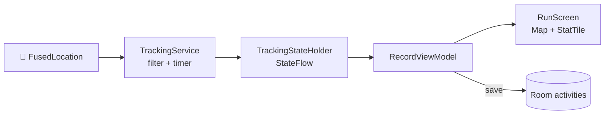
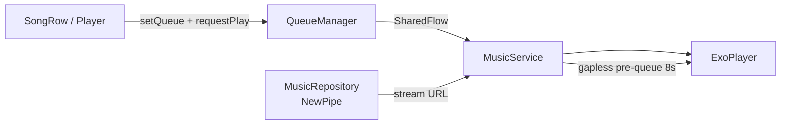

# 🏗️ 02 — Architecture

> MVVM + Hilt, single-module, single-activity. Gampang ditebak: UI di `ui/zrun/`, otak GPS di `tracking/`, otak musik di `service/` + `data/`.

## 🧱 Prinsip

- 📱 **Single-activity** (`MainActivity`) + Compose `NavHost` di `ZRunApp()`.
- 💉 **Hilt** untuk semua singleton (OkHttp, Room, DAO, StateHolder, QueueManager).
- 🧠 **ViewModel per domain**, screen lama Zmusic sudah dihapus — VM-nya dipakai ulang oleh screen ZR.
- 🗣️ Bahasa UI: **Indonesia kasual**.

## 🗺️ Peta File → Tanggung Jawab

| Path | Peran | Analogi |
|------|-------|---------|
| `ZmusicApp.kt` | `@HiltAndroidApp`, init NewPipe + Coil + poToken | 🔌 Steker utama |
| `ui/zrun/ZRunApp.kt` | `NavHost` + bottom-bar + mini-player | 🧭 Shell / frame HP |
| `ui/zrun/ZRunTheme.kt` | Objek `ZR` (warna, gradient Ember) | 🎨 Palet cat |
| `ui/zrun/ZRunComponents.kt` | `EmberButton`, `ZRCard`, `StatTile`, `SongRow`, … | 🧱 Lego UI |
| `ui/zrun/screens/*` (8 file) | Dashboard, Run, Feed, Profile, Music, Search, Playlist, Player | 🖥️ Kamar-kamar |
| `tracking/TrackingService.kt` | Foreground service GPS (penulis data) | ✍️ Pencatat lari |
| `tracking/TrackingStateHolder.kt` | `@Singleton StateFlow<TrackingData>` | 📢 Papan pengumuman |
| `ui/tracking/*ViewModel.kt` | Record / Activities / Detail | 👀 Pembaca papan |
| `service/MusicService.kt` | ExoPlayer + MediaSession (962 baris!) | 🔊 Tukang bunyi |
| `data/local/MusicRepository.kt` | Search/stream/discovery/mood/playlist (~780 baris) | 🕵️ Pemburu lagu |
| `di/AppModule.kt` | Provider OkHttp + Room + 5 DAO | 🏭 Pabrik singleton |
| `util/QueueManager.kt` | `SharedFlow<PlayRequest>` + queue/index/repeat | 🎛️ DJ queue |

## 🔄 Aliran Data (2 mesin terpisah)

### 📍 GPS: Service → StateHolder → ViewModel → UI



Tanpa bind service — UI cukup `collectAsState()` dari holder. Simpel = awet.

### 🎵 Musik: UI → QueueManager → Service → ExoPlayer



`PlayerViewModel` cuma baca `MediaController` untuk progress/isPlaying — jangan kirim perintah playback langsung dari UI selain via `QueueManager`.

## 💉 DI Graph (`di/AppModule.kt`)

```
@SingletonComponent
├── OkHttpClient (shared NewPipe + Coil)
├── AppDatabase (zmusic.db v8 + 7 migrations)
├── SongDao / PlaylistDao / PlayHistoryDao / SearchHistoryDao / ActivityDao
└── (TrackingStateHolder & QueueManager via @Singleton constructor)
```

## 🚦 Aturan Main

1. 🎵 **Jangan utak-atik `MusicService` / `MusicRepository` tanpa baca** [🎵 Music Engine](07-music-engine.md) — rapuh, butuh log diagnostik.
2. 🗄️ **Ubah entity → wajib** naik versi + `Migration` + daftar di `AppModule` → [🗄️ Database](08-database.md).
3. 📍 **Jangan ubah urutan pipeline GPS** (filter → Doppler → glitch → diam → smoothing) → [📍 GPS Engine](06-tracking-gps.md).
4. 📌 Versi cuma di `gradle/libs.versions.toml`.

⏭️ UI detail → [🎨 UI & Navigasi](04-ui-ux-navigation.md) · DB detail → [🗄️ Database](08-database.md).
