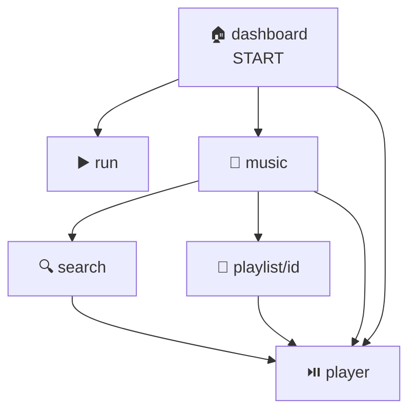

# 🎨 03 — UI / Navigasi / Ember Design System

> Semua UI baru tinggal di `ui/zrun/`. Theme lama (`ui/theme/ZmusicTheme`) cuma base M3 buat dialog/slider — jangan campur.

## 🧭 Routes (`ZRunApp.kt`)

| Route | Screen | Bottom-bar? | Mini-player? |
|-------|--------|-------------|--------------|
| `dashboard` 🏠 | `DashboardScreen` (start) | ✅ | ✅ |
| `music` 🎵 | `MusicHomeScreen` | ✅ | ✅ |
| `run` ▶️ | `RunScreen` | ❌ (fullscreen) | ❌ |
| `feed` 📜 | `FeedScreen` | ✅ | ✅ |
| `profile` 🙋 | `ProfileScreen` | ✅ | ✅ |
| `player` ⏯️ | `PlayerScreenZR` | ❌ | ❌ |
| `search` 🔍 | `SearchScreenZR` | ❌ | ❌ |
| `playlist/{playlistId}` 📃 | `PlaylistScreenZR` (arg `Long`) | ❌ | ❌ |



Navigasi tab pakai pola hemat state:

```kotlin
// ZRunApp.kt:138
navigate(r) {
    popUpTo(graph.startDestinationId) { saveState = true }
    launchSingleTop = true
    restoreState = true
}
```

## 📱 Shell: Bottom-Bar + RUN FAB + Mini-Player

```
┌─────────────────────────┐
│       NavHost           │  ← 8 routes di atas
│                         │
│  ┌───────────────────┐  │
│  │ 🎵 ZRMiniPlayer   │  │  ← muncul kalau queue[idx] != null
│  │ art title ▶ ⏭ ─── │  │     tap → player, ▶/⏸ ⏭ langsung
│  └───────────────────┘  │
│ [Home][Musik](RUN)[Feed][You] │ ← RUN FAB offset -18dp, gradient Ember
└─────────────────────────┘
```

- `barRoutes = {dashboard, music, feed, profile}` — di luar itu fullscreen.
- FAB tengah: lingkaran 58dp `ZR.Ember`, teks `RUN`.

## 🔥 Ember DS (`ZRunTheme.kt` + `ZRunComponents.kt`)

Objek `ZR`: `Bg, Card, Tx, Faint, Ember, Ember2` + gradient helper.

| Komponen | Pakai di | Catatan |
|----------|----------|---------|
| `EmberButton` 🔥 | CTA (Mulai Lari, Play) | Gradient ember, teks putih bold |
| `GhostButton` 👻 | Aksi sekunder | Outline faint |
| `ZRCard` 🃏 | Bungkus section | Rounded 18dp, bg Card |
| `StatTile` 📊 | Jarak / durasi / pace | Angka besar + label kecil |
| `ProgressRing` ⭕ | Target mingguan/tahunan | `progress 0..1` |
| `ArtBox` 🖼️ | Fallback artwork | Gradien + inisial kalau Coil gagal |
| `SectionHeader` 📑 | Judul section + "Lihat semua" | — |
| `SongRow` 🎵 | List lagu | Art + title/artist + durasi + ⋮ |
| `ZRMiniPlayer` 🎛️ | Atas bottom-bar | Progress tipis + kontrol |

Font: `Sora` + `Space Grotesk` di `res/font/`. Ikon: `material-icons-extended`.

## ➕ Tambah Layar Baru (resep 4 langkah)

1. Buat `ui/zrun/screens/NamaScreen.kt` pakai komponen `ZR*` di atas (jangan bikin design system baru!).
2. Tambah `const val` di `Routes` + `composable(...)` di `ZRunApp.kt`.
3. Kalau tab bawah: masukkan ke `barRoutes`. Kalau butuh argumen: tiru pola `playlist/{playlistId}` (`navArgument LongType`).
4. Bahasa UI **Indonesia kasual** ("Mulai lari yuk!" bukan "Commence running").

> ⚠️ `PlayerViewModel` di-share di root (`hiltViewModel()` sekali) — jangan `hiltViewModel()` baru per screen untuk player, nanti queue dobel.

⏭️ Isi tiap layar → [✨ Features](05-features.md).
