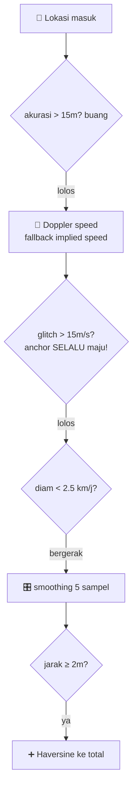

# 📍 05 — Tracking GPS Engine

> Mesin lari: `TrackingService` (penulis) → `TrackingStateHolder` (papan) → `RecordViewModel` (pembaca) → `RunScreen` (wajah). Tanpa bind service.

## 🔧 Komponen

| File | Peran |
|------|-------|
| `tracking/TrackingService.kt` | Foreground service `location`, interval 1 dtk `HIGH_ACCURACY`, notif channel `tracking_channel` id 73, timer 1 dtk (elapsed + moving ≥2.5 km/j) |
| `tracking/TrackingStateHolder.kt` | `@Singleton MutableStateFlow<TrackingData>` (jarak, durasi, moving, speed, route) |
| `ui/tracking/RecordViewModel.kt` | Start/pause/resume/stop + `saveActivity()` → `ActivityDao.insert` |
| `ui/tracking/ActivitiesViewModel.kt` | `observeAll` untuk Dashboard/Feed/Profile |
| `util/LocationUtils.kt` | Haversine + format pace/durasi |
| `model/GeoPoint.kt` + `data/local/RouteConverters.kt` | `lat,lng,ts;...` encode ke kolom `route TEXT` |

## ⛓️ Pipeline Akurasi (JANGAN ubah urutan!)

| Tahap | Angka | Kenapa |
|-------|-------|--------|
| 🗑️ Filter akurasi | `>15 m` buang | GPS indoor ngaco |
| 🚄 Doppler | pakai `location.speed` kalau ada | Lebih stabil dari selisih titik |
| 👾 Glitch filter | `>15 m/s` (≈54 km/j) tolak, **anchor tetap maju** | Kalau anchor diam, titik berikutnya ikut ditolak beruntun! |
| 🛑 Ambang diam | `<2.5 km/j` = diam | Lampu merah nggak nambah jarak |
| 🎛️ Smoothing | rata-rata 5 sampel | Haluskan zig-zag |
| 📏 Jarak min | `≥2 m` baru tambah | Saring jitter |

⏱️ **Pace = `movingMillis` (waktu bergerak), bukan durasi total.** Istirahat nggak merusak pace — ala Strava.

## 🔐 Permission & Manifest

`AndroidManifest.xml`: `FINE/COARSE_LOCATION` + `FOREGROUND_SERVICE_LOCATION (34)` + `POST_NOTIFICATIONS (33)` + `FOREGROUND_SERVICE`. Service `TrackingService` (`location`, `exported=false`). `RunScreen` minta via launcher.

## 🧪 Tes Tanpa Keluar Rumah

1. 📲 Install `app-debug.apk` di HP fisik.
2. 🛰️ **Lockito** (mock location) → rute → kecepatan **~11 km/j**.
3. ▶️ Start di `RunScreen` → cek jarak/pace gerak wajar.
4. 💾 Save → cek muncul di Feed + Dashboard.

## ⚠️ Jebakan Umum

- 🧲 Jangan ganti threshold tanpa uji Lockito + jalan kaki beneran.
- 🪫 Interval 1 dtk + HIGH_ACCURACY = boros baterai — itu harga akurasi. Turunkan hanya kalau paham tradeoff.
- 🗺️ Peta blank ≠ GPS rusak — itu Maps key. GPS tetap ngerekam tanpa key.

⏭️ Data hasil lari → [🗄️ Database](08-database.md) (`activities`).
