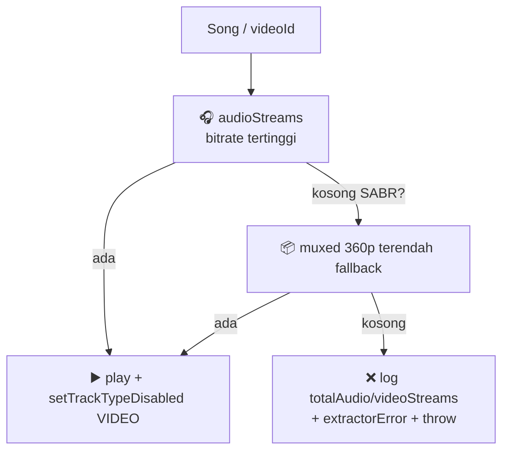

# 🎵 06 — Music Engine (NewPipe + ExoPlayer)

> ⚠️ **Area RAPUH.** YouTube ganti DOM/SABR kapan aja. Baca ini + `NEWPIPE-EXTRACTOR.md` sebelum sentuh. Jangan hapus log diagnostik!

## 🧩 Peta Mesin

| File | Peran |
|------|-------|
| `data/local/MusicRepository.kt` (~780 baris, package `.data` sengaja) | Search 3 hal. ~50 lagu, `getStreamUrl`, discovery kiosk, mood, playlist, history |
| `service/MusicService.kt` (962 baris) | ExoPlayer + MediaSession, gapless pre-queue 8 dtk, audio focus, wifi lock, cache 5 mnt/10 item, retry 3x + backoff |
| `util/QueueManager.kt` | `SharedFlow<PlayRequest>` + `StateFlow queue/index/repeat/shuffle` — **satu-satunya jalan perintah play** |
| `ui/player/PlayerViewModel.kt` | Baca `MediaController` (progress/isPlaying), kirim via QueueManager |
| `data/NewPipeDownloader.kt` | OkHttp impl `Downloader` untuk `NewPipe.init(downloader, "id/ID")` |
| `data/potoken/*` + `ZmusicPoTokenProvider.kt` | poToken standby (WebView BotGuard, fragile) |
| `util/` | `AudioDownloadManager` (offline `localPath`), `EqualizerManager`, `SleepTimerManager`, `DailyMixGenerator`, `AudioSessionHolder` |

## 🎯 Pola Audio-First (`getStreamUrl`)



- 📝 Log `totalAudio/videoStreams` **wajib ada** — itu alat diagnosa SABR.
- 🚫 Jangan `catch (_: Exception)` yang menelan error tanpa `Log.e`.
- 🖥️ Desugar (`desugar_jdk_libs 2.0.4`) wajib untuk `java.time` di minSdk 26.

## 🔄 Fitur Playback

- ⏭️ Gapless: pre-queue 8 dtk sebelum lagu habis.
- 🔁 Repeat / 🔀 smart shuffle anti-cluster artis.
- 😌 Mood hybrid: keyword weighted + history + query + hint (fallback `CHILL`).
- 🎯 TopPicks / MoodMix / RecentFaves + `DailyMixGenerator`.
- ⬇️ Download → `songs.localPath` → diputar offline.
- 📤 Export/import playlist JSON via FileProvider (`${applicationId}.fileprovider` — harus sama persis dengan manifest!).
- 🛡️ ProGuard menjaga Rhino + NewPipe + Room + Media3 + Hilt + Coil (`app/proguard-rules.pro`, 76 baris).

## 🩺 Kalau Musik Gagal (decision tree)

```
play error
├─ cek logcat totalAudio=0? → SABR / YouTube berubah → cek NEWPIPE-EXTRACTOR.md §2-3, coba naikkan extractor v0.26.3→baru
├─ hanya 1 lagu? → videoId region-lock / age-restrict → coba lagu lain
├─ semua lagu? → network / init NewPipe gagal (cek ZmusicApp init + Downloader)
└─ setelah update extractor? → cek ProGuard + desugar + JitPack repo masih ada
```

Lihat tabel versi extractor v0.24.4–v0.26.3 di `NEWPIPE-EXTRACTOR.md` §3 + strategi upgrade §10.

⏭️ Penyimpanan lagu/playlist/history → [🗄️ Database](08-database.md).
